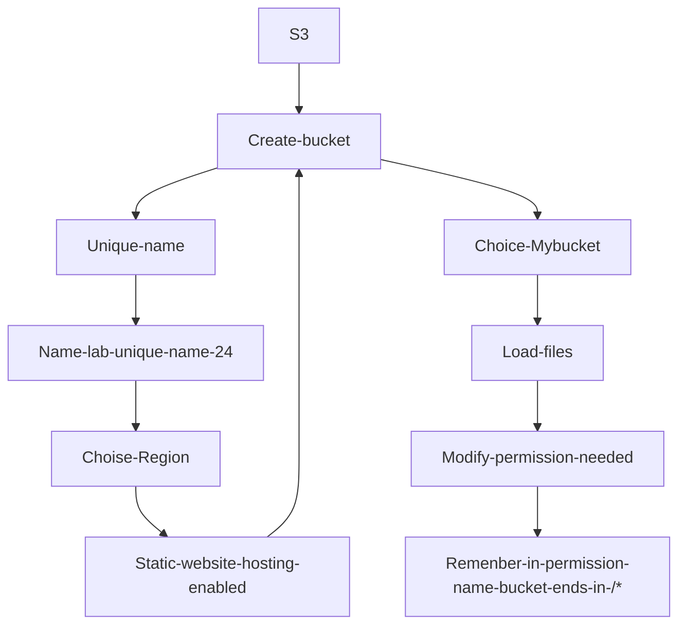

# Amazon RDS


# Alta disponibilidad en amazon RDS 


# Escalabilidad con Amazon RDS 


# Profundizar en Amazon RDS


# Comandos de Amazon RDS en AWS CLI


# Desmostracion Amazon RDS


## Dentro de AWS - Creando una DB 
- Base de datos: aqui esta todas las herramientas relacionadas con base de datos, por lo que podemos ubicar Amazon RDS
- Amazon RDS :  

  - Seleccionamos el tipo de motor
  - Seleccionamos el tamaño de la instancia 
  - Generamos un nombre de usuario 
  - Generamos contraseña
  - Damos un ID de inicio sera el nombre maestro para nuestra base de datos


## Video Amazon DBS



# Creación de un servidor de base de datos e interacción con la base de datos a través de una aplicación. Este laboratorio se diseñó para reforzar la noción de aprovechar las instancias de base de datos administradas por AWS para satisfacer las necesidades de bases de datos relacionales.

Amazon Relational Database Service (Amazon RDS) facilita las tareas de configuración, operación y escalado de una base de datos relacional en la nube. Proporciona una capacidad rentable y de tamaño modificable, al mismo tiempo que permite gestionar las tareas de administración de base de datos que requieren mucho tiempo, lo que permite centrarse en las aplicaciones y el negocio. Amazon RDS le ofrece seis motores familiares de base de datos entre los que elegir: Amazon Aurora, Oracle, Microsoft SQL Server, PostgreSQL, MySQL y MariaDB.

## Objetivos

Después de completar este laboratorio, podrá hacer lo siguiente:

Lanzar una instancia de base de datos de Amazon RDS con alta disponibilidad
Configurar la instancia de base de datos para permitir conexiones desde su servidor web
Abrir una aplicación web e interactuar con su base de datos.
Duración

El tiempo estimado para completar este laboratorio es de 45 minutos aproximadamente.

## Escenario

Comenzará con la siguiente infraestructura:


Tarea 1: crear un grupo de seguridad para la instancia de base de datos de RDS
En esta tarea, creará un grupo de seguridad para permitir que su servidor web acceda a la instancia de base de datos de RDS. El grupo de seguridad se utilizará al lanzar la instancia de base de datos.

En la consola de administración de AWS, encontrará el menú ```Services``` (Servicios), donde debe hacer clic en VPC.

En el panel de navegación de la izquierda, haga clic en ```Security Groups (Grupos de seguridad)```.

Haga clic en ```Create security group (Crear grupo de seguridad)``` y, a continuación, configure lo siguiente:

Security group name (Nombre del grupo de seguridad): DB Security Group (Grupo de seguridad de base de datos)
Description (Descripción): Permit access from Web Security Group (Permitir el acceso desde el grupo de seguridad web)
VPC: Lab VPC
Ahora, agregará una regla al grupo de seguridad para permitir las solicitudes entrantes de base de datos. Actualmente, el grupo de seguridad no tiene reglas. Agregará una regla para permitir el acceso desde el Web Security Group (grupo de seguridad web).

En la sección Inbound rules (Reglas de entrada), elija Add rule (Agregar regla) y, a continuación, configure lo siguiente:

Type (Tipo): MySQL/Aurora (3306)
CIDR, IP, Security Group or Prefix List (CIDR, IP, grupo de seguridad o lista de prefijos): escriba sg y luego seleccione Web Security Group (Grupo de seguridad web).
Así se configura el grupo de seguridad de base de datos para permitir el tráfico entrante en el puerto 3306 desde cualquier instancia EC2 asociada al Web Security Group (grupo de seguridad web).

Desplácese hasta la parte inferior de la pantalla y, a continuación, haga clic en Create security group (Crear grupo de seguridad).

   Utilizará este grupo de seguridad al lanzar la base de datos de Amazon RDS.


# Tarea 2: crear un grupo de subredes de base de datos
En esta tarea, creará un grupo de subredes de base de datos que se emplea a fin de informar a RDS acerca de qué subredes se pueden utilizar para la base de datos. Cada grupo de subredes de base de datos requiere subredes en al menos dos zonas de disponibilidad.

En el menú Servicios, haga clic en RDS.
En el panel de navegación de la izquierda, haga clic en Subnet groups (Grupos de subredes).
    Si el panel de navegación no está visible, haga clic en el ícono del menú  en la esquina superior izquierda.

Haga clic en Create DB Subnet Group (Crear grupo de subredes de base de datos) y, a continuación, configure lo siguiente:
Name (Nombre): DB Subnet Group (Grupo de subredes de base de datos)
Descripción: grupo de subredes de base de datos
ID de VPC: Lab VPC
En la sección Add subnets (Agregar subredes) para zonas de disponibilidad, haga clic en y , a continuación,:
Seleccione  la primera zona de disponibilidad
Seleccione  la segunda zona de disponibilidad
Para Subredes, haga clic en y , a continuación,:
Para la primera zona de disponibilidad, seleccione  10.0.1.0/24
Para la segunda zona de disponibilidad, seleccione  10.0.3.0/24
Haga clic en Crear
   Esto agrega la subred privada 1 (10.0.1.0/24) y la subred privada 2 (10.0.3.0/24). Utilizará este grupo de subredes de base de datos en la creación de la base de datos de la siguiente tarea.


# Tarea 3: crear una instancia de base de datos de Amazon RDS
En esta tarea, deberá configurar y lanzar una instancia de base de datos Multi-AZ de Amazon RDS for MySQL.

Las implementaciones Multi-AZ de Amazon RDS proporcionan mejoras en la disponibilidad y la durabilidad de las instancias de base de datos, lo que las hace adecuadas para las cargas de trabajo de bases de datos de producción. Cuando aprovisiona una instancia Multi-AZ de base de datos, Amazon RDS crea automáticamente una instancia de base de datos principal y, de forma sincronizada, replica los datos a una instancia en espera en una zona de disponibilidad diferente.

En el panel de navegación de la izquierda, haga clic en Databases (Bases de datos).
Haga clic en Create database (Crear base de datos).
    Si ve el mensaje Switch to the new database creation flow (Cambiar al nuevo flujo de creación de bases de datos) en la parte superior de la pantalla, haga clic en él.

Seleccione  MySQL.
En Settings (Configuración), configure lo siguiente:
DB instance identifier (Identificador de instancias de bases de datos): lab-db
Master username (Nombre de usuario maestro): main (principal)
Master password (Contraseña maestra): lab-password
Confirm password (Confirmar contraseña): lab-password
En DB instance size (Tamaño de la instancia de base de datos), configure lo siguiente:
Seleccione  Burstable classes (includes t classes) (Clases ampliables [incluye las clases t]).
Seleccione db.t3.micro
Nota: Si la instancia db.t3.micro no está disponible en la zona de disponibilidad, elija db.t2.micro en su lugar.
En Storage (Almacenamiento), configure lo siguiente:
Seleccione General Purpose (SSD) (Uso general (SSD)) en Storage type (Tipo de almacenamiento).
En Connectivity (Conectividad), configure lo siguiente:

Virtual Private Cloud (VPC): Lab VPC
Ampliar  Additional connectivity configuration (Configuración adicional de la conectividad).

Para Existing VPC security groups (grupos de seguridad de VPC existentes):

Seleccione DB Security Group (Grupo de seguridad de la base de datos) para resaltarlo en azul
Anule la selección default (predeterminada).
Ampliar  Additional configuration (Configuración adicional) y, a continuación, configure lo siguiente:
Initial database name: (Nombre de base de datos inicial): lab
Desmarcar  Enable automatic backups (Habilitar copias de seguridad automáticas).
    Esto desactivará las copias de seguridad, lo que no suele recomendarse, pero permitirá una implementación más rápida de la base de datos para este laboratorio.

Desplácese hasta la parte inferior de la pantalla y, a continuación, seleccione Create base de datos (Crear database).
   Ahora se lanzará la base de datos.

Haga clic en lab-db (haga clic en el propio enlace).
   Espere aproximadamente 4 minutos para que se habilite la disponibilidad de la base de datos. El proceso de implementación implica la implementación de una base de datos en dos zonas de disponibilidad diferentes.

    Mientras espera, debería revisar las Preguntas frecuentes sobre Amazon RDS o bien, tomar un café.

Espere hasta que Info (Información) cambie por Modifying (Modificando) o Available (Disponible).
Desplácese hacia abajo hasta la sección Connectivity & security (Conectividad y seguridad) y copie el campo Endpoint (Punto de enlace).
   Se verá similar a lo siguiente: lab-db.cggq8lhnxvnv.us-west-2.rds.amazonaws.com

Pegue el valor de “Endpoint” (Punto de enlace) en un editor de texto. Lo utilizará posteriormente en el laboratorio.


# Tarea 4: interactuar con la base de datos
En esta tarea, abrirá una aplicación web que se ejecuta en el servidor web y la configurará para utilizar la base de datos.

Copie la dirección IP de WebServer desde el archivo Lab Details.txt o seleccionando en el menú desplegable Details (Detalles) situado encima de estas instrucciones y, a continuación, seleccione Show (Mostrar).
Abra una pestaña del navegador web nueva, pegue la dirección IP del servidor web y presione “Enter” (Intro).
   Se visualizará la aplicación web, que mostrará información acerca de la instancia EC2.

Haga clic en el enlace de RDS situado en la parte superior de la página.
   Ahora, configurará la aplicación para que se conecte a la base de datos.

Configure los siguientes ajustes:
Endpoint (Punto de enlace): pegue el punto de enlace que copió anteriormente en un editor de texto.
Database (Base de datos): lab
Username (Nombre de usuario): main
Password (Contraseña): lab-password
Haga clic en Submit (Enviar).
   Se visualizará un mensaje en el cual se explica que la aplicación está ejecutando un comando para copiar información en la base de datos. Después de algunos segundos, verá una Address Book (libreta de direcciones) en la aplicación.

   La aplicación de la libreta de direcciones utiliza la base de datos de RDS para almacenar información.

Agregue, edite y elimine contactos para probar la aplicación web.
   Los datos se conservan en la base de datos y se replican automáticamente en la segunda zona de disponibilidad.


- Usuario maestro: admin
- Master password: 12345678
- indentificador : database-1ad
- nombre de base : my_db 


